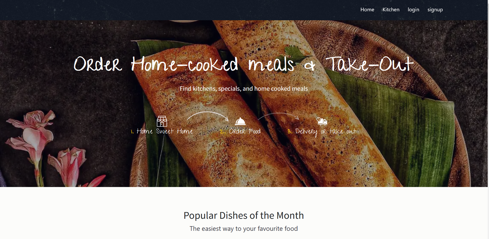
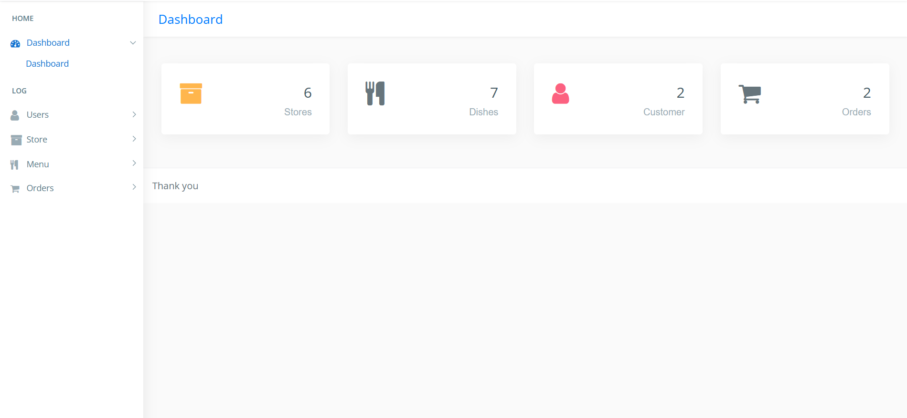

# README

## About this project?

The Home-Based Cloud Kitchen is a web platform designed to connect home-based chefs with food enthusiasts. This project facilitates a seamless culinary experience by offering features such as menu management, order processing, and secure transactions. With a focus on user-friendly design, real-time order tracking, and robust data security, this platform aims to foster a thriving online culinary community.

## Features

Chef and Food Enthusiast Profiles: Allow chefs to create and manage their profiles, and food enthusiasts to explore and follow their favorite chefs  
Menu Management: Chefs can easily add, update, and delete menu items with detailed descriptions and pricing.  
Order Processing: Food enthusiasts can browse menus, place orders, and track their order status in real-time.  
Real-Time Notifications: Notify users about order status updates and other relevant information.  
User-Friendly Design: An intuitive interface designed for easy navigation and interaction.  
Robust Data Security: Implemented measures to protect user data and transactions.

(.gitbook/assets/4.png)

## Admin Dashboard

To access admin portal type this in your URL BAR **\`root**/admin/ \`  where **root** is your root directory

 **Admin credentials:** Username: **admin** Password: **1234**

## Technologies Used

1. PHP
2. SQL
3. BOOTSTRAP 4
4. AJAX
5. JQUERY

## System Requirements

Software : XAMPP / Wamp / Mamp/ Lamp 

